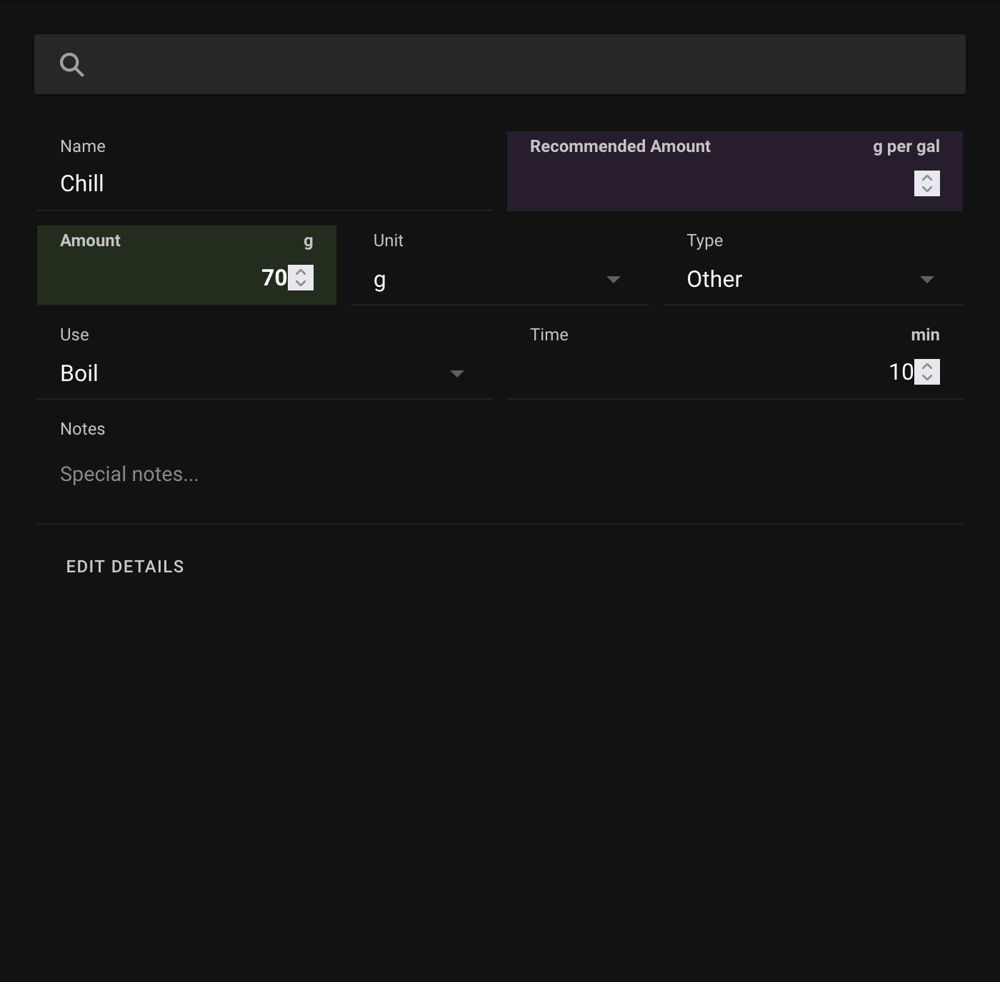
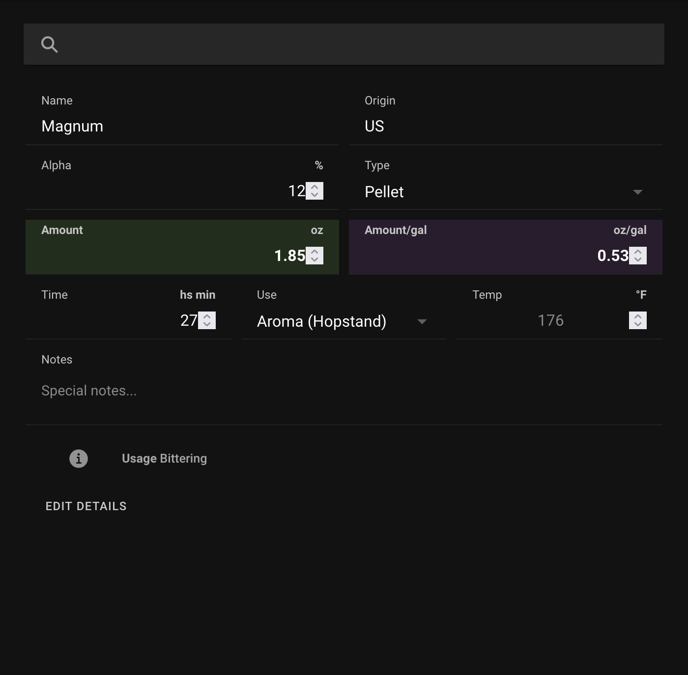

# Brewfather to Pico

I am an SDK that transforms Brewfather recipes into pico brewing instructions.

## How to install

```
python -m pip install bf2pico
```

## How to use bf2pico

```
from bf2pico import BrewFather

recipe = BrewFather(
    userid=userid,
    apikey=apikey
)

recipe = recipe.pico()
```

## Command Tools
- `recipe` - A cli to interact with brewfather recipes outputing in pico format.
- `events` - A event process that updates the brew logs for active brews.

### How to use a Chiller

If you want to add a chill to connect a chiller and use the Zymatic pump to run the wort through a chiller, you can do so. Add a `misc` ingredient to your recipe with the name Chill. Set the amount to the target temperature and the time to pump at that temperature.

**In this screenshot, we are chilling to 70 degrees and pumping for 10 minutes after we hit our target temperature.**


## How to Whirlpool

If you want to add a Whirlpool hop addition, you do that by specifying the hop addition type being **Aroma (Hopstand)**.

**_NOTE:_** The Whirlpool hops **MUST BE** the last bin used.

The screenshot below shows a Whirlpool for 27 minutes.




## Environment Variables

- BF2PICO_CACHE: Default 1 minute, set the default cache time
- BF2PICO_CACHE_LOCATION: Default `~/.bf2pico` the location for the cache
- BREWFATHER_USERID: The default user_id to use
- BREWFATHER_APIKEY: The default api_key to use
